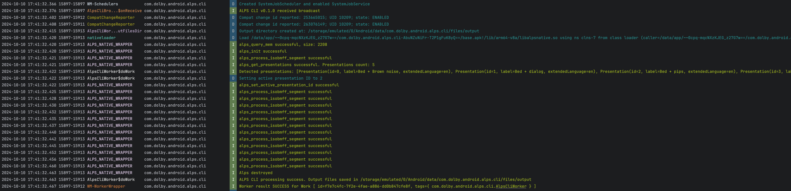

# Android ALPS CLI tool
A headless android app for processing ISO BMFF segments with ALPS core library. 

## Setup environment
App has to be installed on android device or an emulator.

Which version of ALPS library is used, depends on CLI version. See [RELESENOTES](RELEASENOTES.md).

## Usage
### Install tool
To install CLI on the device run
```bash
adb install <path-to-apk>
```
### Run processing 
Processing is triggered by sending broadcast intent:
```bash
adb shell am broadcast -n "com.dolby.android.alps.cli/.AlpsCliBroadcastReceiver" -a "com.dolby.android.alps.cli.PROCESS" [options]
```
Available options:
- --es input <input_dir> Specifies the input files (segments) directory name/path. This path is 
relative to app's files dir (e.g. _/storage/emulated/0/Android/data/com.dolby.android.alps.cli/files_)
- --es output <output_dir> Specifies the output files (segments) directory name/path. This path is
relative to app's files dir
- --ei pres <pres_number> Specifies presentation ID to be enabled after processing

Combined example:
```bash
--es i input --es o output --ei pres 2
```
### Push and pull files onto and from device
Files must have been placed inside ALPS CLI tool external memory dir which is:
```bash
/storage/emulated/0/Android/data/com.dolby.android.alps.cli/files
```
Inside it, you can use any structure.
To push files into (as an example) **input** directory, use this command:
```bash
adb push <path-to-files-on-your-machine> /storage/emulated/0/Android/data/com.dolby.android.alps.cli/files/input
```
To pull processed files, assuming that value for **output** option was **output**:
```bash
adb pull /storage/emulated/0/Android/data/com.dolby.android.alps.cli/files/output <destination-path>
```
**adb push** behaves differently depending on whether directory exists or not, so I recommend to
clean directory before pushing files again:
```bash
adb shell rm -rf /storage/emulated/0/Android/data/com.dolby.android.alps.cli/files/input
```
Alternatively, you can use different directories names (input1, input2,...).

### Monitoring
Beside result files, debug version of the app will print some useful logs to console, that could be
used for errors monitoring and more. To filter logs, use this command:
```bash
adb logcat --pid=$(adb shell pidof com.dolby.android.alps.cli | tr -d '\r')
```
Example logs:




