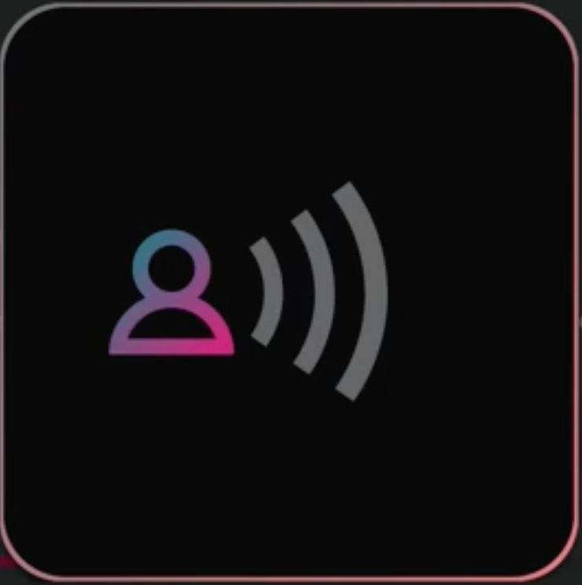
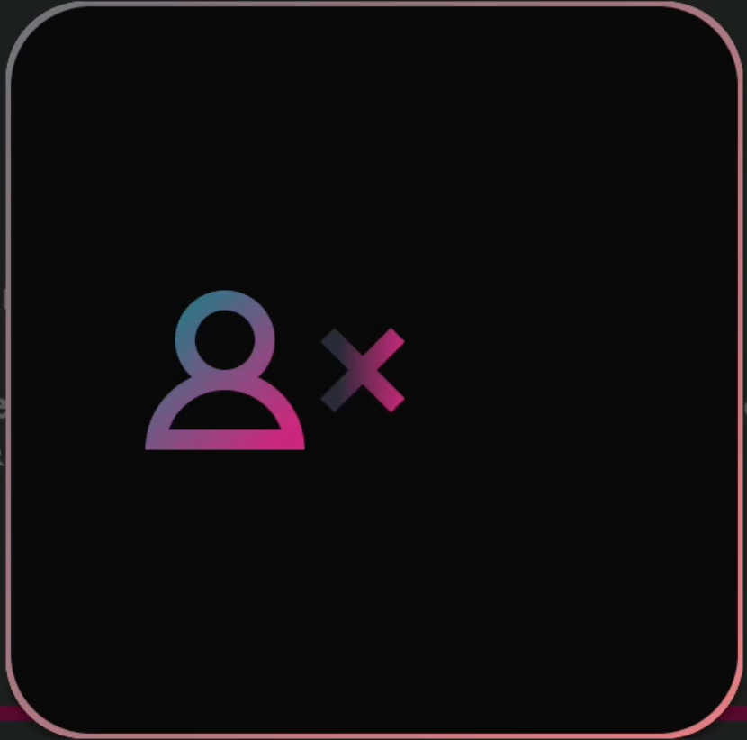
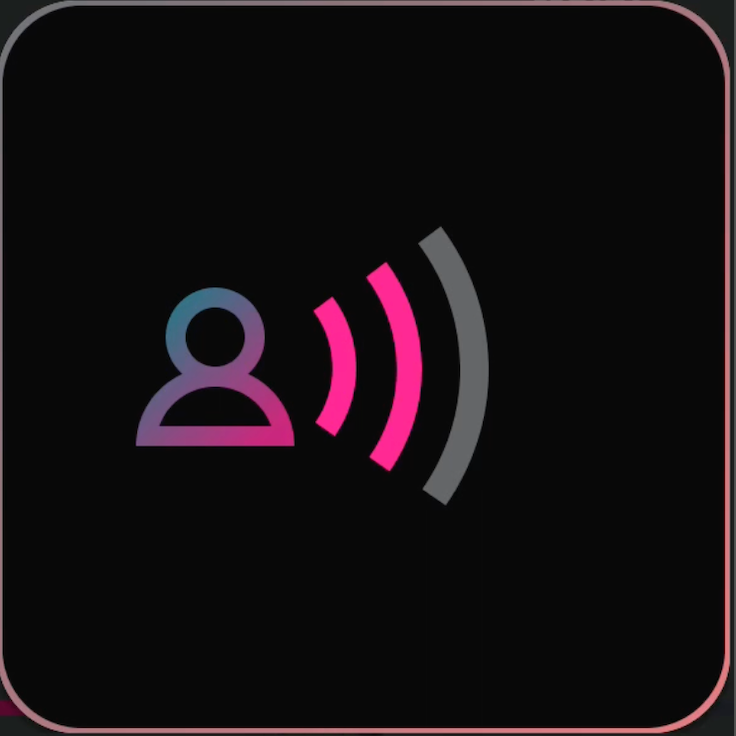

# Android ALPS Sample app
Sample playback application with ALPS library integrated. Application uses ExoPlayer and doesn't 
introduce any custom changes to Media3.

## Table of Contents
- [Installation](#installation)
- [App configuration](#app-configuration)
- [DRM](#drm-content)
- [Dialog Enhancement](#dialog-enhancement)

## Installation
Dolby doesn't provide built version of sample app. It is desired to be an integration example code. 
Nevertheless, anyone can build the app locally. To do so, clone this repository and run:
```bash
gradle app:assembleDebug
```
or use Android Studio UI.

## App configuration
App can be configured using Settings JSON file. File must be hosted online (S3 for example) and
publicly available.
### Inject custom Settings JSON
Default Settings JSON link is hardcoded into app code during build time.

To inject your own Settings (with you own Content JSON link), you need to run app using adb 
([Android Debug Bridge](https://developer.android.com/tools/releases/platform-tools)) with link to
your Settings JSON provided as an Extra:
```bash
adb shell am start -n com.dolby.android.alps.app/.MainActivity --es "SETTINGS" "<your-link>"
```
Replace *<your-link>* with actual link to your Settings JSON, for example: 
https://json-lists.s3.eu-central-1.amazonaws.com/android_sample_app_settings_test.json.

Provided link will be saved in app memory, so next time you can open app normally. To overwrite the 
link, use the same command again. To get back to default Setting - clean app memory (app data/storage),
through device settings UI or using this command:
```bash
adb shell pm clear com.dolby.android.alps.app
```
### Settings
Settings json scheme must match 
[AppSettings class structure](src/main/java/com/dolby/android/alps/app/data/models/AppSettings.kt).

### Content list
**contentListUrl** field in Settings JSON defines URL that will be used to load content. Content 
list JSON must be an **array** of Content items. Single content item structure must match 
[Content class structure](src/main/java/com/dolby/android/alps/app/data/models/Content.kt).

### Categories
Categories available in the app are generated automatically based on content items **category** 
fields values. To group items - set their **category** to the same value.

## DRM content
DRM content is supported since v0.3.0. To enable playback, it is **required** to provide
**drmLicenceServerURL** value for the content on the content list. Which DRM type is supported
depends on the device running the app.

## Dialog Enhancement
Application is prepared to demo AC-4 presentations based dialog enhancement. For proper demoing,
content must meet certain [requirements](#content-requirements) and on the content list,
**presentationChangeStyle** must be set to **dialogEnhancementIcon** for that content.

### Content requirements
For proper handling of dialog enhancement in sample app, content needs to be prepared properly.
The assumptions regarding AC-4 stream are:
- First presentation is "original" meaning no dialog enhancement is applied
    - That presentation will be represented by 0 waves active/pink



- Last presentation is "dialog off"
    - That presentation will be represented by X instead of waves shown



- Presentations between first and last are supposed to have rising dialog enhancement
    - Amount of presentations between first and last one will match amount of waves on UI (DialogEnhancementComponent).
    - UI implementation can handle from 0 to 4 of these presentations (DE levels)
    - Current Dialog Enhancement level will be represented by active/pink waves



- Total amount of presentations should be between 2 and 6 - result of previous assumptions.